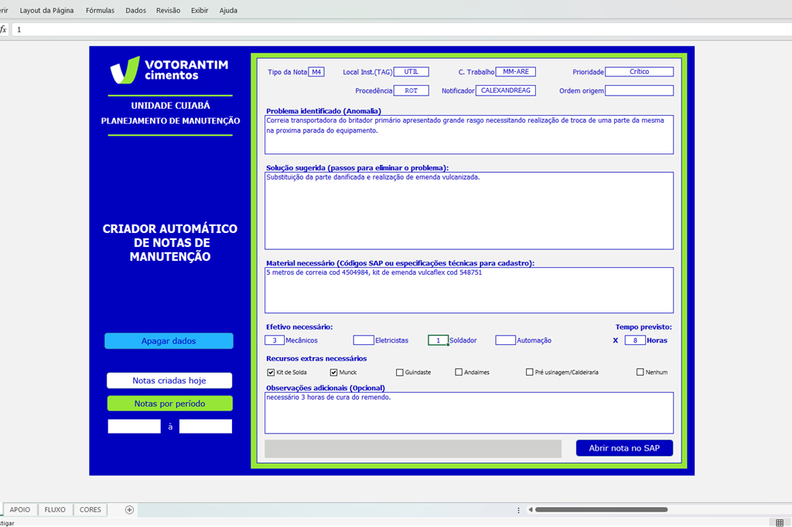
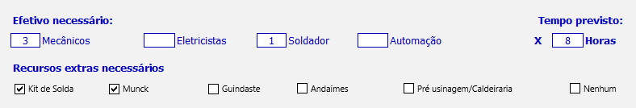

# Planilha geradora de notas de manutenção no SAP
### Projeto usando Excel + Programação em VBA e linguagem de Script SAP

## 🧩 Problema
Dentro do fluxo de relato de anomalias em equipamentos e tratativas para sua solução temos varias etapas que dependem intrinsecamente que a abertura de nota de manutenção (solicitação de correção para a manutenção) seja feita com objetividade e riqueza de informações. Este relato necessita ser feito com o máximo de detalhes para que a solução seja alcançada com maior eficiência. Empiricamente no contexto industrial ocorrem varios problemas, retrabalhos e solucoes incorretas ou não efetivas devido as notas serem criadas sem as informações essenciais.

Exemplo: problemas relatados parcialmente não contemplando a verdadeira razão do defeito; compra de peças erradas por especificação equivocada; dificuldade na execução a correção porque o problema real diverge do relatado, etc.

## 🎯 Objetivo  
Criar um formulário padrão de abertura que force o usuário a descrever todas as informações essenciais para a solução do problema. E assim facilitar todas as demais etapas da solução     
Informar:  
1 - qual anomalia identificada;  
2 - qual solução sugerida;  
3 - quais materiais necessários com código de cadastro;  
4 - efetivo tecnico;  
5 - recursos extra como uso de solda, caminhão munck, etc;  
6 - obervações complementares.  

## 🛠️ Ferramentas e Tecnologias
- Excel avançado com criação de formulário com regra de negócio.  
- Linguagem: VBA (Visual Basic for Applications) usando lógica de programação para validação de requisitos e sinergia de informações entre excel e SAP.    
- Linguagem de script SAP para abertura e prenchimento de transações do sistema SAP;  

## 🔍 Etapas do Projeto
1 - identificação do problema (alto numero de notas incompletas, dificuldade de tratativas, baixa eficiência na execução;  
2 - Análise e comportamento do fenômeno e entendimento do fluxo correto de tratativas de manutenção;  
3 - levantamento de requisitos para eliminar o problema;  
4 - construção da ferramenta;  
5 - Realização de testes e treinamento da equipe;  
6 - Inplantação e acompanhamento da evolução dos indicadores

## 🚀 Melhorias adiquiridas pelo uso da ferramenta
- Efetividade: a planilha checa se todos os campos foram devidamente preenchidos e notifica o usuário para corrigir erro de preenchimento;  
- Facilidade: com as opções de click unico o uso da planilha tornar a bertura de nota ainda mais rapido do que digitar manualmente;
  
- Praticidade: Após todos os checks a planilha abre uma tela do SAP e preenche todas os campos e salva a nota em alguns segundos.

## 📈 Resultados Principais
- Padronização na abertura de notas com riqueza de informações;
- Maior celeridade na tratativa das notas pela equipe de PCM por ter maior clareza no entendimento;
- Fluxo de programação mais claro e eficiente;
- Melhor objetividade na execução por ter melhor entendimento da anomalia e solução proposta
- Melhor eficiência no fluxo de compras e de requisições do estoque devido a melhor especificação de materiais.

## 🧭 Próximos Passos
- Implementar a opção do usuário poder informar o período e a planilha extrair um relatório com lista de notas abertas pelo mesmo num dado período.
- Criar interação com planilha de itens do almox para usuário consultar lista de peças do estoque.

## 👤 Autor
Alexandro Grigório Ferreira 
📧 alexanndro@gmail.com  
🔗 https://www.linkedin.com/in/alexsidius/ 
🔗 https://github.com/Alexsidius 

*Este projeto faz parte dos meus trabalhos como Analista de manutenção e tem como objetivo demonstrar habilidades práticas de análise e soluções de negócios*.
